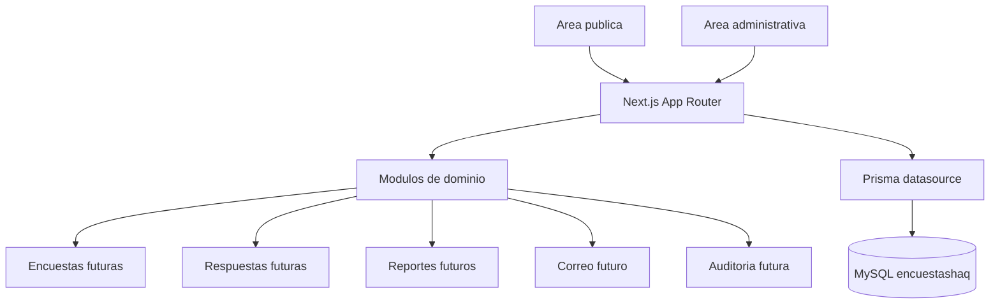

# Arquitectura

Este proyecto usa una arquitectura modular sobre Next.js con App Router. El cuestionario publico envia sus respuestas a un Route Handler, que las valida con Zod y las almacena mediante Prisma.

Estado actual de la base de datos: incluye la tabla `survey_responses` para conservar las respuestas, el idioma y la fecha de cada envio.

## Modulos

- `src/app`: rutas publicas, administrativas y endpoints HTTP.
- `src/components`: componentes reutilizables separados por contexto.
- `src/lib/security`: firma y validacion de la sesion administrativa.
- `src/modules/surveys`: definicion y ejecucion futura de encuestas.
- `src/modules/invitations`: invitaciones y tokens futuros.
- `src/modules/responses`: captura y consulta futura de respuestas.
- `src/modules/reports`: graficas, PDF y Excel futuros.
- `src/modules/email`: envio futuro de correos.
- `src/modules/audit`: registro futuro de eventos relevantes.
- `src/lib`: utilidades compartidas de infraestructura, entorno, seguridad y validacion.
- `src/types`: tipos compartidos cuando existan contratos transversales.

## Area publica

El area publica incluye `/` y `/encuesta/[token]`. La ruta de encuesta solo muestra un marcador provisional. El token no se procesa, no se guarda y no se valida todavia.

## Area administrativa

El area administrativa se encuentra en `/admin`. La misma ruta muestra el formulario de acceso cuando no existe una sesion valida y, tras autenticar, consulta estadisticas y las 25 respuestas mas recientes. La sesion se guarda en una cookie `HttpOnly` firmada y expira despues de ocho horas. `/admin/login` redirige a `/admin`.

## Encuestas

El modulo futuro de encuestas usara SurveyJS mediante `survey-core` y `survey-react-ui`. En esta etapa no existe cuestionario funcional.

## Respuestas

El modulo de respuestas guarda cada encuesta completa y prepara los datos que consume el panel administrativo.

## Reportes

El modulo futuro de reportes preparara graficas con Recharts, exportaciones Excel con ExcelJS y documentos PDF con PDFKit.

## Correo

El modulo futuro de correo usara Nodemailer. Las variables SMTP son opcionales en desarrollo para permitir ejecutar la aplicacion sin servidor de correo.

## Auditoria

El modulo futuro de auditoria registrara eventos administrativos y operativos cuando exista el modelo correspondiente.

## Preparacion para Hostinger

La configuracion separa variables de entorno, aplicacion Next.js y base MySQL. Para Hostinger sera necesario configurar variables productivas, un `AUTH_SECRET` real, credenciales administrativas robustas y la conexion MySQL administrada antes de publicar.

## Diagrama

